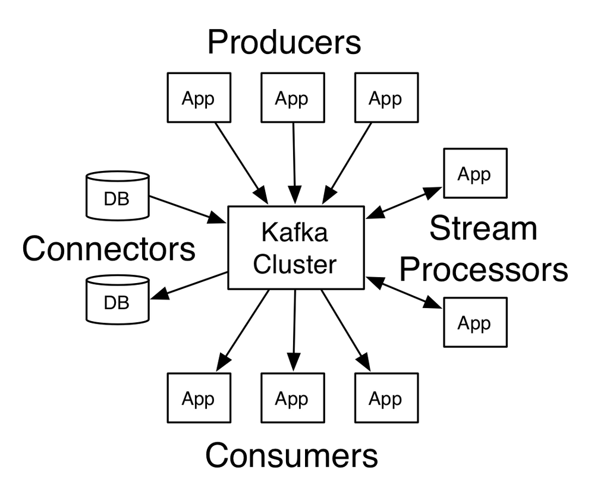
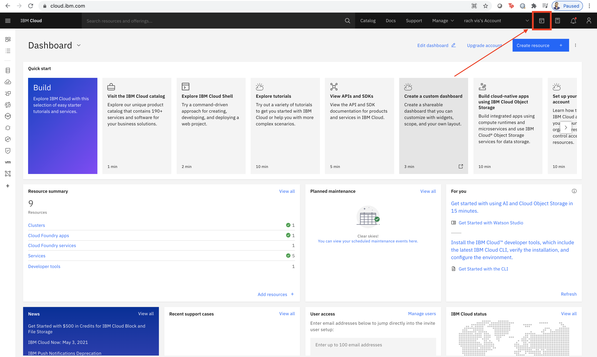
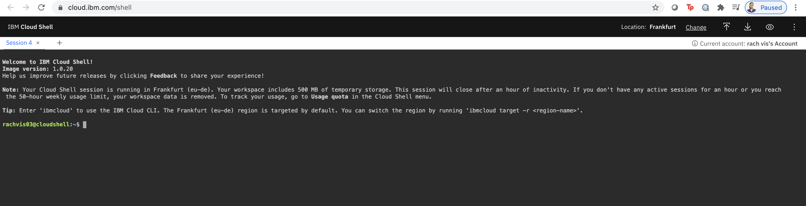

# Kafka101

## Apache Kafka is a distributed streaming platform

A streaming platform has three key capabilities:

* Publish and subscribe to streams of records, similar to a message queue or enterprise messaging system.
* Store streams of records in a fault-tolerant durable way.
* Process streams of records as they occur.

#### Kafka is generally used for two broad classes of applications:

* Building real-time streaming data pipelines that reliably get data between systems or applications
* Building real-time streaming applications that transform or react to the streams of data

To understand how Kafka does these things, let's dive in and explore Kafka's capabilities from the bottom up.

#### First a few concepts:

* Kafka is run as a cluster on one or more servers that can span multiple datacenters.
* The Kafka cluster stores streams of records in categories called topics.
* Each record consists of a key, a value, and a timestamp.

#### Kafka has four core APIs:

* The Producer API allows an application to publish a stream of records to one or more Kafka topics.
* The Consumer API allows an application to subscribe to one or more topics and process the stream of records produced to them.
* The Streams API allows an application to act as a stream processor, consuming an input stream from one or more topics and producing an output stream to one or more output topics, effectively transforming the input streams to output streams.
* The Connector API allows building and running reusable producers or consumers that connect Kafka topics to existing applications or data systems. For example, a connector to a relational database might capture every change to a table.

    

In Kafka the communication between the clients and the servers is done with a simple, high-performance, language agnostic TCP protocol. This protocol is versioned and maintains backwards compatibility with older version. We provide a Java client for Kafka, but clients are available in many languages.

## IBM Event Streams

Event Streams offers a fully managed Apache Kafka service, ensuring durability and high availability for our clients. By using Event Streams, you have support around the clock from our team of Kafka experts.

You can use Event Streams to complete the following tasks:

* Offload work to back-end worker applications
* Connect event streams to streaming analytics to realize powerful insights
* Publish event data to multiple applications to react in real time

In Event Streams, applications send data by creating a message and sending it to a topic. To receive messages, applications subscribe to a topic and choose to either receive all the topic's messages or to share the messages between them. Event Streams hosts and maintains the messages in an ordered sequence.

## Event Streams Starter Lab

1. Login to your [IBM Cloud account](https://cloud.ibm.com/) and from the right top corner, navigate to IBM Cloud Shell.

 

2. You will be taken to a Web CLI where you can create sessions and use commands. It will look something like this.

 

3. Provision an instance of Event Streams from IBM Cloud Catalog.
Note: Make sure you select the region to be Dallas if you are usig Lite plan.

4. On Cloud Shell, the plugins are already installed. We can just use the init method to start using them. But if you are using any other CLIs, you will have to install IBM Cloud Plugin and IBM Event Streams Plugin.

 Use an init command to initialise event streams plugin on IBM Cloud Shell.

 ```
ibmcloud es init
 ```

 This command will return an API endpoint and gives an OK status if the command run is sucessful.

 To see more commands that are available, you can use a help command

 ```
ibmcloud es help
 ```

 This will return you the list of commands that are available

5. To get the details of your kafka cluster on IBM Cloud, use the following command.
  ```
  ibmcloud es cluster
  ```
  This will return your cluster id, the number of controllers and Details of your Brokers(like broker ID, Host and Port of broker). Similarly, you can check details of your brokers as well. Use the following commands.
  Command
  ```
  ibmcloud es broker broker-id
  ```
  Example
  ```
  ibmcloud es broker 0
  ```
  This will return details of the broker with broker id 0

  To check more details about broker, use the following command which will fetch you broker configuration.
  Command
  ```
  ibmcloud es broker-config broker-id
  ```
  Example
  ```
  ibmcloud es broker-config 0
  ```
  This will return you details like log.cleaner.io.buffer.load.factor, sasl.enabled.mechanisms, delegation.token.max.lifetime.ms, offsets.topic.compression.codec, replication.quota.window.num, queued.max.request.bytes etc.

6. Similarly, we can use cli to create topics, see the topic description, delete topics etc. Use the following commands to create a topic and see the topic details. Mention the topic name and number of partitions.
Lite plan allows only one partition for topics. Here are some of the commands we can use.
  Commands
  ```
  ibmcloud es topic-create
  ibmcloud es topics
  ibmcloud es topic-name
  ```
  Use the following command to create a topic in your Event Streams Service.
  ```
  ibmcloud es topic-create kafka-java-console-sample-topic --partitions 1
  ```
  Output
  ```
  Created topic kafka-java-console-sample-topic
  OK
  ```
  Go back to your service ui and check if the topic is created.

  To list the topics you have
  Command
  ```
  ibmcloud es topics
  ```
  ```
  Topic name   
  kafka-java-console-sample-topic   OK
  ```

  To check details of your topic

  ```
  ibmcloud es kafka-java-console-sample-topic
  ```
  Output
  ```
  Details for topic kafka-java-console-sample-topicTopic name                        Internal?   Partition count   Replication factor   
  kafka-java-console-sample-topic   false       1                 3   Partition details for topic kafka-java-console-sample-topic
  Partition ID   Leader   Replicas   In-sync   0              0        [0 2 1]    [0 2 1]   
  Configuration parameters for topic kafka-java-console-sample-topicName                  Value   min.insync.replicas   2   
  segment.bytes         536870912   retention.ms          86400000   retention.bytes       104857600   
  cleanup.policy        delete   OK
  ```

7. Now go back to your service UI and check if your topic is created. Go to Service Credentials and create new credentials.

8. Clone the sample repository
  ```
   git clone https://github.com/ibm-messaging/event-streams-samples.git
  ```
  ```
  cd event-streams-samples/kafka-java-console-sample
  ```
  ```
  gradle clean && gradle build
  ```

9. Run the Consumer Service

  ```
  java -jar ./build/libs/kafka-java-console-sample-2.0.jar
<kafka_brokers_sasl> <api_key> -consumer
  ```

10. Open a new session on IBM Cloud Shell. Run the producer Application.

  ```
  java -jar ./build/libs/kafka-java-console-sample-2.0.jar
<kafka_brokers_sasl> <api_key> -producer
  ```

Success!
When the producer starts, messages are produced to the topic. Messages are then consumed from the topic by the consuming application. You can verify the successful flow of messages when you seeINFO Message consumed from the consumer.

The sample runs indefinitely until you stop it. To stop the process, run an exit command Ctrl+C.
